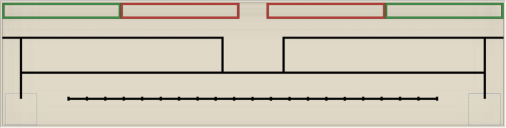

## Initial State
Moves up and to the right until the ultrasonic sensor detects the first flower on the flower line.
 - We should consider ```right``` and ```left``` team cases. 
 - The next state could possibly be either the ```correction state``` or the ```grab state```. 
 - If the robot lines up well enough to the first plant then we could just go straight to the ```grab state```. But ```correction state``` should be used until we actually test that.
 
 #### Exits for Initial State 
 - Initial ---> Correction
 

 
```
if (leftTeamConfiguration):
	move up and to the right until ultrasonic is triggered
	if (ultrasonic):
		stop robot
		go to grab state
if (rightTeamConfiguration):
	move up and to the left until ultrasonic is triggered
	if (ultrasonic):
		stop robot
		go to grab state
```

It is possible that we may need to create a ```right``` and ```left``` configuration for every state.

## Correction State
This will adjust the angle of the track so that it is 90˚ and shift = 0.
Once angle is 90˚ and shift is 0, then it would proceed to the ```move state```.

#### Only possible exit for Correction State 
- Correction ---> Move

```
if (angle < 90):
	correct one way

if (angle > 90):
	correct the other way

if (angle == 90 && shift == 0):
	proceed to moving state
```
 
 
 
## Grab State
This assumes the robot is stopped.
It will grab the current plant, identify the color and rotate it into position.

#### Only possible exit for Grab State 
- Grab ---> Correction

```
pos = 0
# 0 = no plant 
# 1 = green 
# 2 = red 

plantArr [] = {0, 0, 0, 0, 0, 0, 0, 0, 0, 0}

if (camera == green)
	plantArr[pos] = 1
	pos++
	plantCount++

if (camera == red)
	plantArr[pos] = 2
	pos++
	plantCount++

```

We will have a dynamic and static array to know where the plant is located on the robot.
 - Dynamic array will know the location of the plant relative to the drop/grab position.
 - Static array will be in charge of knowing the order/color of plants.
Since the robot is stopped already, then it will proceed to the ```correction state```.


## Move State
This state will move the robot in whatever direction needed.
It will periodically check the shift and angle.

#### Possible ways to exit Move State
 - Move ---> Correction
 - Move ---> Grab 
 - Move ---> Drop

```
if ((shift && angle) == outOfBounds):
	go to correction state

if (ultraSonic):
	stop robot
	go to grab state

if (horizontalLine && (plantCount == 10)):
	bool up = true
	moveUp()

if (verticalLine && (plantCount == 10) && up):
	moveBack()
	drop = true
					
if (verticalLine && (plantCount == 10) && up && drop):
	go to drop state

```

Once it reaches the end of the line it will be ready to drop 
and the drop boolean will be true

```bool drop = true```

Since drop is true, the robot now knows that it should be moving to the right again.


## Drop State
Drop state assumes that the robot is stopped.
Robot should move through the static and dynamic arrays to drop the 5 green plants.
then 5 red plants.

#### Only possible exit for Drop State
- Drop ---> Correction

```
greenCount = 5
redCount = 5

while (greenCount > 0)
	if (plantArr[pos] == 1):
		drop()
		greenCount--
		plantArr[pos] = 0

while (redCount > 0)
	if (plantArr[pos] == 2):
		drop()
		redCount--
		plantArr[pos] = 0
	
```
There is no movement in the ```drop state```.
It should drop a plant then proceed to the ```correction```/```move``` states.


	
